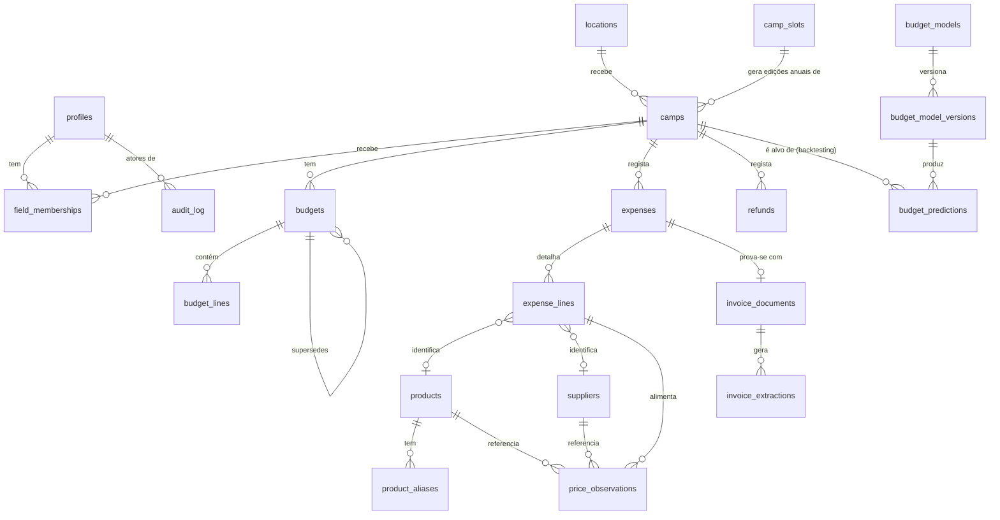

# ERD — CAMTIL Finance V2

Status: **PROPOSED.** Nenhuma tabela foi criada. Nomes podem mudar em implementação — o que importa é o modelo de responsabilidades.



---

## Entidades

### `profiles`
**Responsabilidade:** identidade de cada pessoa (estende `auth.users` do Supabase Auth).
- PK `id` (= `auth.users.id`)
- `full_name`, `phone` (opcional), `global_role` (`admin`|`tesoureiro`|`direcao`|null — null = sem role global, só memberships de campo)
- `created_at`, `revoked_at` (soft — nunca apagar uma pessoa que já foi ator de despesas/audit_log)
- RLS: o próprio vê/edita a sua linha (campos não-sensíveis); `admin` vê/edita tudo.

### `field_memberships`
**Responsabilidade:** liga uma `profile` a um `camp` com um role de campo — substitui o PIN partilhado de hoje.
- PK `id`; FK `profile_id → profiles`, `camp_id → camps`
- `role` (`adjunto`) — hoje só um valor, mas modelado como coluna (não booleano) para admitir roles de campo futuros sem migration
- `created_by → profiles`, `created_at`, `revoked_at` (soft revoke — histórico de quem teve acesso quando fica preservado, importante para auditabilidade)
- Constraint: `UNIQUE(profile_id, camp_id) WHERE revoked_at IS NULL`
- RLS: ver [AUTHORIZATION.md](./AUTHORIZATION.md).

### `locations` *(substitui/estende `locais`)*
**Responsabilidade:** identidade reutilizável de um local de campo — existe independentemente de qualquer edição anual.
- PK `id`; `name`, `address`, `active`
- **Novo, para o motor de orçamento (§10 do pedido):** `support_house_distance_km` (distância à casa de apoio), `urban_center_distance_km` (distância a centro urbano/supermercados) — hoje inexistente em qualquer lado do schema atual.
- RLS: leitura geral; escrita só `admin`.

### `camp_slots` *(novo — identidade do campo, independente do ano)*
**Responsabilidade:** resolve o pedido §7 "distinguir identidade do campo de edição anual". Um `camp_slot` é a coisa que se repete todos os verões (ex. "Aranhiços I").
- PK `id`; `escalao`, `ordem` (I/II/III...), `label` (denormalizado para exibição)
- Constraint: `UNIQUE(escalao, ordem)`
- Sem isto, "comparar o mesmo campo entre anos" (pedido explícito da Tesouraria) exigiria comparar por nome de texto, frágil a pequenas variações de naming ao longo dos anos.

### `camps` *(substitui `campos` — só a edição anual)*
**Responsabilidade:** uma edição concreta de um `camp_slot`, num ano, num local.
- PK `id`; FK `camp_slot_id → camp_slots`, `location_id → locations`
- Identidade/config: `year`, `start_date`, `end_date`, `precamp_start_date`, `precamp_end_date`, `num_campers`, `num_leaders`, `order_in_summer` (posição do campo na sequência do verão — fator explícito pedido para o motor de orçamento)
- Financeiro: `opening_balance` (=`saldo_inicial`)
- Ciclo de vida: `status` (`draft`|`active`|`closed`|`archived`) — substitui os dois padrões inconsistentes de hoje (`arquivado` boolean vs. nada em `despesas`)
- `created_at`
- RLS: ver [AUTHORIZATION.md](./AUTHORIZATION.md).
- **Nota:** `pin` desaparece desta tabela — autenticação deixa de depender de um segredo guardado numa coluna de dados de negócio.

### `budgets` / `budget_lines` *(novo — resolve §8)*
**Responsabilidade:** orçamento como entidade **versionada**, nunca sobrescrita.
- `budgets`: PK `id`; FK `camp_id → camps`; `version int`; `status` (`draft`|`proposed`|`approved`|`closed`); `created_by/at`, `approved_by/at`; `superseded_by → budgets.id` (nullable, self-FK — a versão anterior aponta para a que a substituiu, histórico completo preservado)
- `budget_lines`: PK `id`; FK `budget_id → budgets`; `code` (categoria), `amount`, `notes`
- Constraint: só pode existir **um** `budgets` com `status='approved'` e `superseded_by IS NULL` por `camp_id` de cada vez (o "orçamento aprovado em vigor")
- RLS: ver [AUTHORIZATION.md](./AUTHORIZATION.md).

### `expenses` *(≈ `despesas` de hoje)*
- PK `id`; FK `camp_id → camps`, `invoice_document_id → invoice_documents` (nullable)
- `numero_recibo`, `date`, `amount`, `code`, `type` (`despesa`|`receita`), `nif_confirmado`
- `created_by → profiles` (**novo** — hoje não há proveniência de quem lançou a despesa)
- `created_at`
- Constraint: mantém `UNIQUE(camp_id, numero_recibo)` (já corrigido em produção, migration 016 — não regredir)
- RLS: ver [AUTHORIZATION.md](./AUTHORIZATION.md) — nota: **sem DELETE livre**, ao contrário de hoje.

### `expense_lines` *(≈ `despesa_linhas`, com FKs estruturadas)*
- PK `id`; FK `expense_id → expenses`, `product_id → products` (nullable), `supplier_id → suppliers` (nullable)
- `quantity`, `unit`, `unit_price`, `total_price`, `confidence`, `status`, `source` (`manual`|`ocr`|`qr`|`ai`) — `tipo_linha`/`confianca`/`estado` passam a **enums reais com CHECK**, não texto livre (corrige achado de "colunas pouco estruturadas" da auditoria)

### `refunds` *(≈ `devolucoes`)*
- Estrutura equivalente à de hoje; FK `original_expense_id → expenses` (nullable)

### `invoice_documents` *(novo — separa "o ficheiro" de "a despesa")*
**Responsabilidade:** a fotografia/documento em si, com proveniência própria — pode existir antes de estar ligado a uma despesa confirmada.
- PK `id`; FK `camp_id → camps`, `uploaded_by → profiles`
- `storage_path`, `content_hash` (SHA-256, para deteção de duplicados), `uploaded_at`, `status` (`uploaded`|`processing`|`processed`|`failed`)

### `invoice_extractions` *(novo — resolve §10)*
**Responsabilidade:** cada tentativa de extração de dados de um `invoice_document`, por qualquer motor.
- PK `id`; FK `invoice_document_id → invoice_documents`
- `extractor_id`, `extractor_version`, `model_used`, `confidence`, `raw_response` (jsonb), `extracted_fields` (jsonb), `duration_ms`, `cost_usd`, `status` (`pending`|`success`|`failed`), `error`
- `confirmed_by → profiles` (nullable), `confirmed_at`
- **Histórico imutável** — uma nova tentativa é uma nova linha, nunca um UPDATE sobre a anterior.

### `products` / `product_aliases` *(resolve parte de §9)*
- `products`: PK `id`; `name`, `category`, `unit_base`
- `product_aliases`: PK `id`; FK `product_id → products`; `alias_text`, `source` (`ocr`|`manual`|`ai`), `confidence` — substitui `produto_aliases` de hoje, mesma ideia, ligado ao produto canónico novo em vez de diretamente a `ingredientes` (que fica em Mamãs, arquivado)

### `suppliers` *(novo — não existe hoje do lado Adjuntos)*
- PK `id`; `name`, `nif` (nullable, nem toda a fatura tem NIF de fornecedor claro), `type` (`supermercado`|`talho`|`padaria`|`posto_combustivel`|`outro`), `notes`
- Resolve diretamente o achado "sem tabela de fornecedores" da auditoria (Top 10, #7).

### `price_observations` *(resolve §9 — o histórico de preços pedido)*
**Responsabilidade:** dataset analítico derivado, **distinto** da verdade operacional.
- PK `id`; FK `product_id → products`, `supplier_id → suppliers` (nullable), `camp_id → camps` (nullable — algumas observações são comunitárias, não ligadas a um campo), `expense_line_id → expense_lines` (nullable — proveniência quando existe)
- `date`, `quantity`, `unit`, `unit_price`, `total_price`, `source` (`expense_line`|`manual`|`community`), `confidence`
- **Regra de desenho explícita (pedida):** uma correção em `price_observations` (ex. Tesoureiro normaliza um outlier) **nunca** reescreve `expense_lines` — `expense_lines` é a verdade contabilística e fica imutável depois de confirmada; `price_observations` é gerado a partir dela (processo de servidor) e pode ser recalculado/corrigido independentemente.

### `budget_models` / `budget_model_versions` / `budget_predictions` *(motor de orçamento — só o esqueleto)*
- `budget_models`: PK `id`; `name`, `description`, `algorithm_type`
- `budget_model_versions`: PK `id`; FK `budget_model_id`; `version`, `parameters` (jsonb), `status` (`draft`|`active`|`retired`), `created_at`
- `budget_predictions`: PK `id`; FK `budget_model_version_id`; `camp_id` (nullable — permite prever para um campo hipotético/backtesting), `predicted_total`, `predicted_lines` (jsonb), `explanation` (jsonb — fatores e pesos, obrigatório), `predicted_at`
- **Imutável** — nunca UPDATE; uma nova previsão é sempre uma nova linha.

### `audit_log`
- PK `id`; `actor_id → profiles` (nullable — eventos de sistema); `action` (texto controlado, ex. `expense.created`), `entity_type`, `entity_id`, `before` (jsonb, nullable), `after` (jsonb, nullable), `reason` (texto, opcional), `metadata` (jsonb), `created_at`
- Só escrito no servidor (Server Actions / triggers) — nunca pelo cliente.

---

## `camps` como entidade histórica — resumo (§7)

| Camada | Onde vive | Muda com que frequência |
|---|---|---|
| Identidade do campo | `camp_slots` (escalão + ordem) | Nunca (é a "série") |
| Local | `locations` | Raramente — o mesmo local serve vários anos |
| Edição anual | `camps` | Uma vez por ano por slot |
| Configuração operacional do ano | campos diretos em `camps` (datas, participantes, saldo) | Uma vez por ano, com possíveis ajustes antes de `active` |
| Dados históricos (execução real) | `expenses`/`expense_lines`/`refunds`/`budgets` ligados a esse `camps.id` | Durante o campo, depois congelado em `closed` |

## Produtos, fornecedores e preços — resumo (§9)

```
expense_lines  →  verdade operacional/contabilística (imutável após confirmação)
      │
      └── alimenta (processo de servidor, não escrita direta do utilizador)
            ↓
price_observations  →  dataset analítico derivado (pode ser corrigido/recalculado
                        sem tocar em expense_lines)
```

Isto substitui diretamente as três tabelas sobrepostas identificadas na auditoria (`campo_precos`, `precos`, `valores_referencia`): `valores_referencia` mantém-se como está (é orçamento de referência, não preço observado); `campo_precos`/`precos` são substituídas por `price_observations`, com proveniência clara e sem duplicação de conceito.
